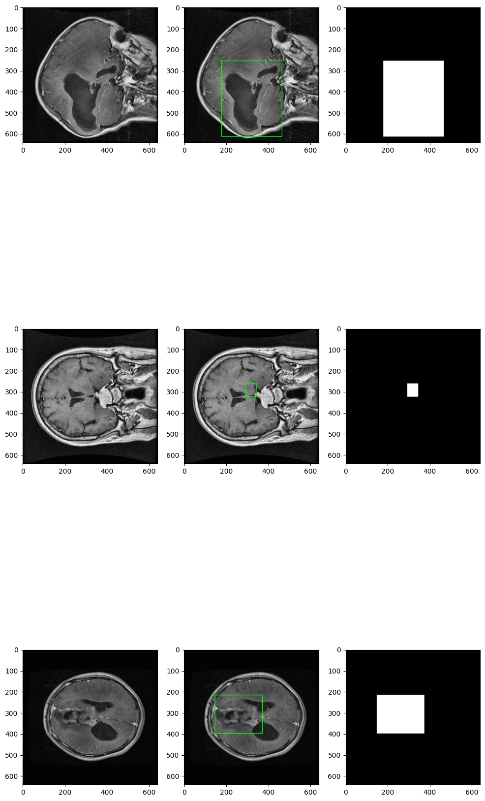

# Brain‑Tumor MRI Semantic Segmentation

AI LAB HKA: https://www.kaggle.com/datasets/pkdarabi/brain-tumor-image-dataset-semantic-segmentation/discussion?sort=undefined

"The TumorSeg Computer Vision Project is dedicated to Semantic Segmentation, which involves classifying every pixel in an image as part of a tumor or non-tumor region. This fine-grained approach provides an accurate understanding of the spatial distribution of tumors within medical images."

**Brain‑Tumor Image Dataset (Semantic Segmentation)** by pkdarabi on Kaggle.

---

## 1 – Dataset

| Detail                | Value                                                              |
| ----------------------| -------------------------------------------------------------------|
| Kaggle slug           | `pkdarabi/brain-tumor-image-dataset-semantic-segmentation`         |
| Classes               | **2** (non‑tumor = 0, tumor = 1)                                   |
| Image count           | ≈ 2 146 slices 1502 Train, 429 Valid, 215 Test                     |
| Native image size     | 512 × 512 px                                                       |
| resized image size    | 640 × 640 px                                                       |
| info                  | Tumors are annotated in COCO Segmentation format.                  |


Download via the Kaggle CLI or web UI:

```bash
kaggle datasets download -d pkdarabi/brain-tumor-image-dataset-semantic-segmentation
```
### Example Slice with Segmentation




---

## 2 – Project Goal

1. **Establish a minimally viable CNN baseline.**  
2. **Swap in a standard U‑Net** show clear improvement on the same split.  
3. **Introduce an advanced U‑Net flavor (optional)** (U‑Net++, Attention U‑Net, or similar) to push metrics further.  
4. **Document every step** so that results can be reproduced.  

---

## 3 – Timeline & Milestones
We use 06 -> 20 Jun as a buffer, depending on vanilla U-Net progress.

| Week / Due Date         | Main Focus                                                        | Key Deliverables                                           | Done |
| ----------------------- | ----------------------------------------------------------------- | ---------------------------------------------------------- | :--: |
| **≤ 09 May**            | **Research** – dataset inspection, planning                       | timeline, Architecture choice, repo, define Metrics        | ☐    |
| **09 → 16 May**         | **Project & Data Setup → Baseline CNN**                           | Training notebook/script, first evaluation, short Report   | ☐    |
| **16 → 23 May**         | **Classic U‑Net** – implement vanilla U‑Net                       | working Model, first segmentation examples                 | ☐    |
| **23 → 30 May**         | **Classic U‑Net** – implement and test on valdata                 | Metrics table, qualitative segmentation examples           | ☐    |
| **30 May → 06 Jun**     | **U‑Net tuning and eval** –  regularization, pre/post‑processing? | full evaluation on testdata, extended Report               | ☐    |
| **06 → 20 Jun**         | **Advanced U‑Net** – implement, tune, test                        | this is optional, depends on progress                      | ☐    |
| **20 → 27 Jun**         | **Docu and Slides** – prepare Presenation                         | Final report, slides                                       | ☐    |


---

## 4 – Metrics

* **Primary:** 
* **Secondary:** 
* **Runtime:** 

_All metrics are logged per‑epoch und zusammengefasst auf dem Validation‑Set; das Hold‑out Test‑Set wird nur einmal im finalen Report verwendet._  

---
## 5 – Upcoming Questions for Meetup

**9 May**: Timeline realistic? Implementing CNN first a good idea or go with u-net right away? is u-net the model to go, alternatives? advanced u-net realsitic? Dataset has bounding boxes, but we want segmentation how we match data?
    **Nodes**: 

